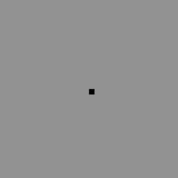
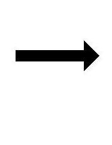
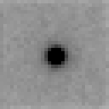

# bin_stuff
command-line programs for performing mathematical operations on flat binary data files

<title>X-ray data manipulation utilities</title>

<h1>X-ray data manipulation utilities</h1>

<h2>convert, add, subtract, multiply or whatever</h2>

These short programs are convenient tools for manipulating and interconverting flat data files of type float, int, or short.  
I wrote them to &quot;hack&quot; X-ray images and electron density map files, but you might find
 more tricks for them to perform.  Documentation is divided by program, with cross-referencing between them:
<dl>
<dt>
<h3><a href=docs/xray_formats.html>description of X-ray file formats</a></h3>
</dt>
<dd>
Brief description of how SMV, CBF and CCP4 map files work, and how you can manipulate them.
</dd>
<dt>
<h3><a href=docs/int2float.html>int2float</a></h3>
</dt>
<dd>
Convert 16-bit integers, such as SMV-formatted images into floating-point for overlay of or combination with X-ray data.
</dd>
<dt>
<h3><a href=docs/floatgen.html>floatgen</a></h3>
</dt>
<dd>
Convert text data into floating-point for overlay of or combination with X-ray data.
</dd>
<dt>
<h3><a href=docs/float_add.html>float_add</a></h3>
</dt>
<dd>
Add, subtract, scale and offset raw floating-point flat files with arbitrary headers.
</dd>
<dt>
<h3><a href=docs/float_func.html>float_func</a></h3>
</dt>
<dd>
Perform any C function on one or two raw floating-point flat files with arbitrary headers.
</dd>
<dt>
<h3><a href=docs/noisify.html>noisify</a></h3>
</dt>
<dd>
Add any kind of noise to floating-point flat files and output SMV-formatted X-ray data.
<dd>
</dd>
</dl>

Author:
<ADDRESS><A HREF="mailto:JMHolton@lbl.gov">James Holton &lt;JMHolton@lbl.gov&gt;</A></ADDRESS>
 
</html>
