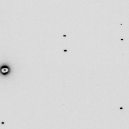

# float_add: combine/compare files of 4-byte floating-point numbers


This simple program reads two flat files of 4-byte single precision "float" numbers
and adds them together with different scale factors to create a new flat file of
4-byte single-precision "float" numbers.  Various statisics are printed, including
the correlation coefficient and least-squares linear fit, before and after applying 
a user-selctable outlier rejection
algorithm.


`float_add` is useful for direct side-by-side comparision of real and simulated data,
for combining different simulations together (such as spots from [nanoBragg][nanobragg]
and background from [nonBragg][nonbragg], or simply re-scaling a set of floating-point data.

These flat floating-point files can then be input into image generation programs like
[noisify][noisify] or combined with simulation data from [nearBragg][nearragg].
It can also generate data to directly replace the voxel values in an electron density map.

## source code

source: [float_add.c](float_add.c)

There are no dependencies beyond the standard C math libraries shipped with essentailly
all modern C compilers.

## compile

```bash
gcc -o float_add float_add.c -lm
```

## example usage

Now say you want the skewness of an electron density map, such as the one we created in the example for
[floatgen](floatgen.md), called 3Dball.map.  This file is float data with a header of 1104 bytes.
So, we just run:

```bash
./float_add -header 1104 3Dball.map
```

output:

```bash
filename: 3Dball.map  input1
header = 1104 bytes pixel zero offset = 0 (0 in output)
xy lsq scale= 0 offset= 0
yx lsq scale= 0 offset= 0
32768 pixels 
0 overflows, 0 underflows
max = 1 min = 0
mean = 0.0854492 rms = 0.292317 rmsd = 0.279549 skewness = 2.96585 kurtosis = 9.79629
CC = -nan
writing output.bin as a 1104-byte header with 32768 4-byte floats
```

This gives you all of the stats that the CCP4 mapdump program might give you,
in addition to the skewness, kurtosis. If you give it two maps on the same grid 
it will also give you the correlation coefficient (CC), and the linear least-squares
coefficents that will optimally scale one map to the second map.
For example, let's scale and offset this map:

```bash
./float_add -header 1104 3Dball.map -scale1 1.234 -outoffset 0.1234 -outfile rescaled.map
./float_add -header 1104 3Dball.map rescaled.map
```

output:

```bash
filename: 3Dball.map  input1
filename: rescaled.map  input2
header = 1104 bytes pixel zero offset = 0 (0 in output)
xy lsq scale= 1.234 offset= 0.1234
yx lsq scale= 0.810373 offset= -0.1
32768 pixels 
0 overflows, 0 underflows
max = 2.3574 min = 0.1234
mean = 0.314294 rms = 0.69914 rmsd = 0.624512 skewness = 2.96585 kurtosis = 9.79629
CC = 1
writing output.bin as a 1104-byte header with 32768 4-byte floats
```

You can see that the xy lsq scale reflects the scale and offset we just
applied to the map. The yx lsq scale and offset is the scale and offset
you would get the other way.

For more complicated cases, outliers can throw off the lsq fit, as well as the
other statistics.  This is why I implemented automatic outlier rejection 
into float_add.


Now use the SMV image example from [int2float][int2float] to convert the X-ray image into
float values. Get an SMV x-ray image here:

```bash
wget http://bl831.als.lbl.gov/example_data_sets/ALS/831/Gd_lyso1/ALS831_lyso_Gd_001.img
```

 

Convert the SMV image to floats

```bash
./int2float -header 512 ALS831_lyso_Gd_001.img smv.bin
```

Now we can use `float_add` to get some statistics:

```bash
./float_add smv.bin
```

output:

```bash
filename: smv.bin  input1
header = 0 bytes pixel zero offset = 0 (0 in output)
xy lsq scale= 0 offset= 0
yx lsq scale= 0 offset= 0
9437184 pixels 
0 overflows, 0 underflows
max = 32609 min = 0
mean = 42.9596 rms = 55.5302 rmsd = 35.1864 skewness = 371.769 kurtosis = 238568
CC = -nan
writing output.bin as a 0-byte header with 9437184 4-byte floats
```

But these statistics include the "invalid" pixels (zero and overflows).  To keep these out of 
the stats we can flag them:

```bash
./float_add smv.bin -ignore 0 -ignore 65535
```

output:

```bash
filename: smv.bin  input1
header = 0 bytes pixel zero offset = 0 (0 in output)
ignoring value 0 in both files
ignoring value 65535 in both files
xy lsq scale= 0 offset= 0
yx lsq scale= 0 offset= 0
73572 invalid of 9437184 pixels ( 9363612 left)
0 overflows, 0 underflows
max = 32609 min = 4
mean = 43.2971 rms = 55.748 rmsd = 35.1169 skewness = 376.905 kurtosis = 242337
CC = -nan
writing output.bin as a 0-byte header with 9437184 4-byte floats
```

Also, the valid pixels in this image have an offset of 40 pixel units, and one photon hit
creates an average pixel increment of 1.6 levels (ADU).  See the description of the
[xray formats](xray_formats.md). So, if we want to convert the image into photons, we do this:

```bash
./float_add smv.bin smv.bin -scale1 0.625 -scale2 0 -ignore 0 -ignore 65535 -offset 40 -outoffset 0 -outfile photons.bin
```

output:

```bash
filename: smv.bin  input1
filename: smv.bin  input2
header = 0 bytes pixel zero offset = 40 (0 in output)
ignoring value 0 in both files
ignoring value 65535 in both files
xy lsq scale= 1 offset= 0
yx lsq scale= 1 offset= 0
73572 invalid of 9437184 pixels ( 9363612 left)
0 overflows, 0 underflows
max = 20355.6 min = -22.5
mean = 2.06071 rms = 22.0446 rmsd = 21.948 skewness = 376.905 kurtosis = 242337
CC = 1
writing photons.bin as a 0-byte header with 9437184 4-byte floats
```

Notice that the input data smv.bin was provided twice, but one image was given a scale of zero.

You can also use `float_add` to operate on [CCP4-formatted electron density maps][maplib].
For example, take the [3Dball.map](3Dball.map) example map we created in the example for
[floatgen](floatgen.md). What if we wanted to add a constant value of "0.5" 
electrons/A<sup>3</sup> to every value in the map?

We would do this:

```bash
./float_add -header 1104 3Dball.map 3Dball.map -outoffset 0.5 -outfile offset.map
```

output:

```bash
filename: 3Dball.map  input1
header = 1104 bytes pixel zero offset = 0 (0.5 in output)
xy lsq scale= 0 offset= 0
yx lsq scale= 0 offset= 0
32768 pixels 
0 overflows, 0 underflows
max = 1 min = 0
mean = 0.0854492 rms = 0.292317 rmsd = 0.279549 skewness = 2.96585 kurtosis = 9.79629
CC = nan
writing offset.map as a 1104-byte header with 32768 4-byte floats
```

The new map will now have the offset value, but note that the density stats stored in the header
will now be wrong!  `float_add` simply copies the header from the input to the output. To "sanitize"
the map you will want to run it though a [CCP4 suite][ccp4] program that re-calculates the stats in
the header, such as [mapmask][mapmask]:

```bash
echo scale factor 1 | mapmask mapin offset.map mapout new.map
mv new.map offset.map
```

## Usage

```
float_add file1.bin file2.bin [outfile.bin] -scale1 1.0 -scale2 1.0 -offset 40 -header 512
```

## Command-line options

***-scale1***

scale factor for first file

***-scale2***

scale factor for second file

***-offset***

integer offset to be subtracted from each file

***-outoffset***

integer offset to be added to the output file

***-outfile outfile.bin***

specify name of output file

***-header***

number of bytes to ignore in header of each file (header of file1 copied to output)

***-normalize***

output relative difference (a-b)/((a+b)/2) instead of difference

***-histogram***

print out a histogram of output values

***-binsize***

size of the bins to use for the histogram

***-epsilon***

maximum difference between values to be considered equal

***-ignore***

flag particular values as bad pixels, kept in output

***-reject***

reject outliers from printed statistics


## Author
<ADDRESS><A HREF="mailto:JMHolton@lbl.gov">James Holton &lt;JMHolton@lbl.gov&gt;</A></ADDRESS>
<br>

[adxv]: https://www.scripps.edu/tainer/arvai/adxv.html
[rigaku]: https://www.rigaku.com
[mosflm]: http://www.mrc-lmb.cam.ac.uk/harry/mosflm/
[hkl]: http://www.hkl-xray.com
[xds]: http://xds.mpimf-heidelberg.mpg.de
[fmodel]: http://www.phenix-online.org/documentation/fmodel.htm
[refmac]: https://www2.mrc-lmb.cam.ac.uk/groups/murshudov/content/refmac/refmac.html
[sfall]: https://www.ccp4.ac.uk/html/sfall.html
[imagemagick]: http://www.imagemagick.org
[noisify]: https://github.com/bl831/bin_stuff/blob/main/docs/noisify.md
[float_add]: https://github.com/bl831/bin_stuff/blob/main/docs/float_add.md
[float_func]: https://github.com/bl831/bin_stuff/blob/main/docs/float_func.md
[float_mult]: https://github.com/bl831/bin_stuff/blob/main/docs/float_mult.md
[int2float]: int2float.md
[ccp4]: https://www.ccp4.ac.uk
[maplib]: https://www.ccp4.ac.uk/html/maplib.html
[coot]: https://www2.mrc-lmb.cam.ac.uk/personal/pemsley/coot/
[nanobragg]: https://github.com/bl831/nanoBragg
[nearbragg]: https://github.com/bl831/nearBragg
[nonbragg]: https://github.com/bl831/nanoBragg
[mapmask]: https://www.ccp4.ac.uk/html/mapmask.html