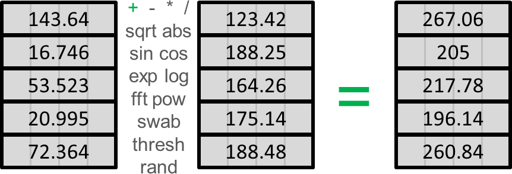
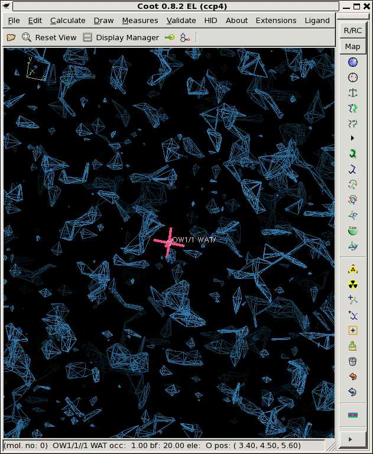
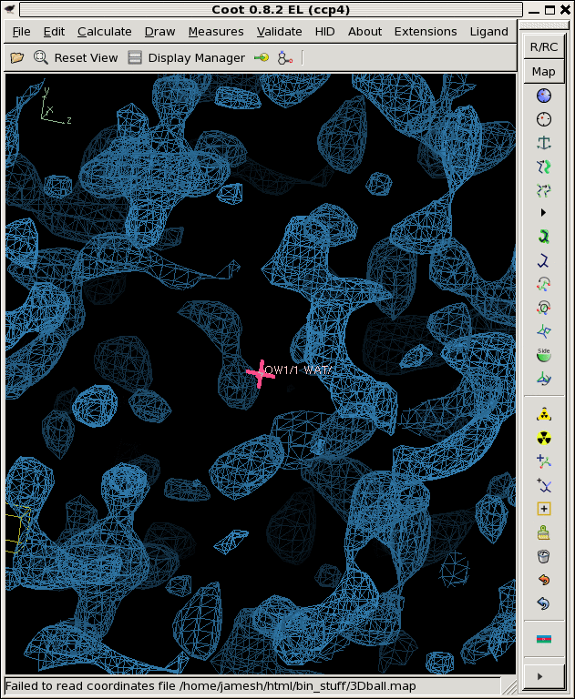
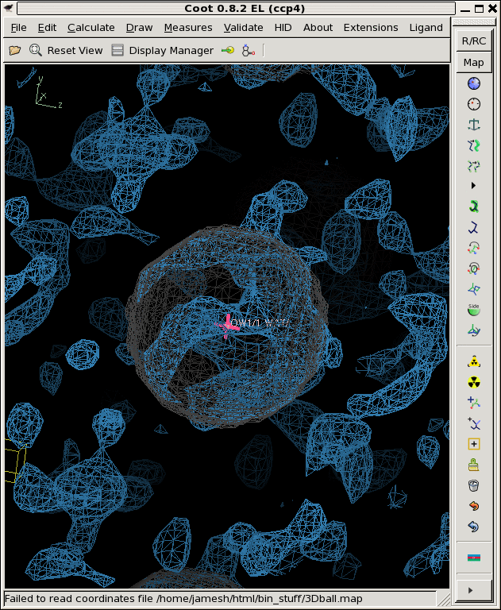
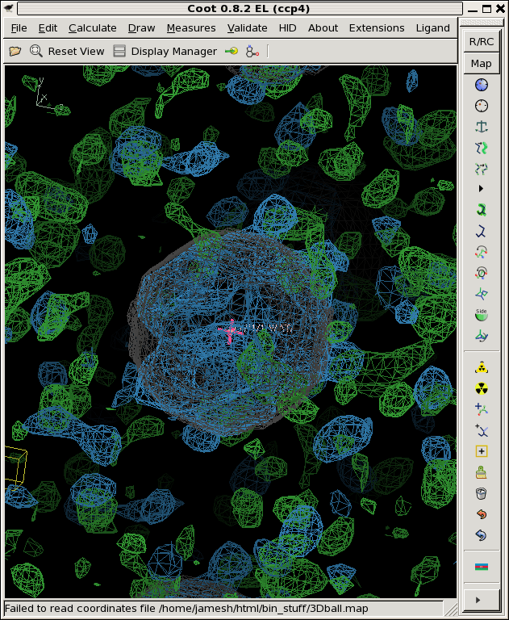
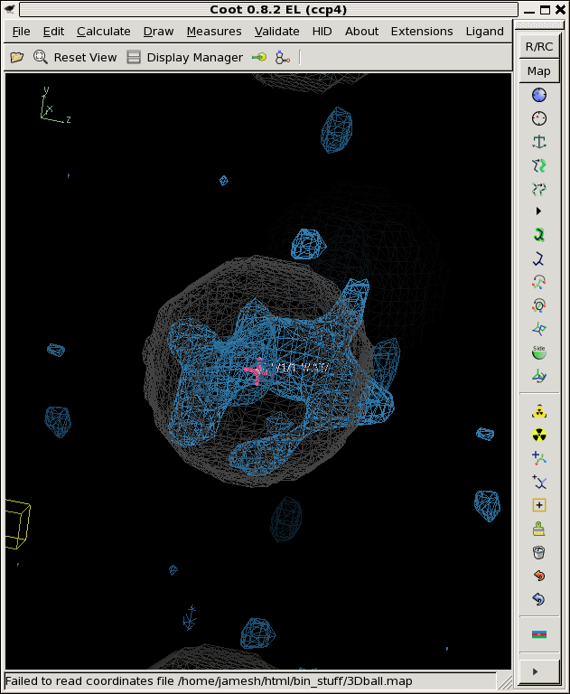
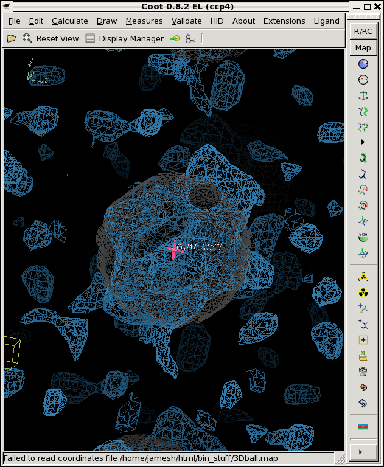
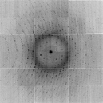
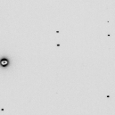

# float_func: operate on files of 4-byte floating-point numbers



This simple program reads one or two flat files of 4-byte single precision "float" numbers
and operates on them using a variety of user-selectable functions.  Essentially the full
C standard library is available, plus a few extras.  Data in the files can be simply
added, subtracted, multiplied or divided, or the first taken to the power of the second, 
run through a bessel function, take an FFT, swap bytes, convert amplitude-phase pairs into
complex numbers (a,b), any trigonometric or hyperbolic trig function, minimum or maximum of the
two inputs, cut at a threshold, set to zero, sqare root, cube root, exponential, log,
error function, or replace with random values from six different distributions.  A full
description of all the options is given in the command-line description below.
The output is a new flat file of 4-byte single-precision "float" numbers.

`float_func` is useful for arbitrary transformations of data that may or may not be 
supported by the software you are currently using.  For example, taking the square
root of an electron density map is not gnerally an available feature, but absolutely
essential if you are trying to derive the "noise level" from the variation in a family of maps.
You may also then want to take the "rho" and "sigma(rho)", divide one by the other
and then convert the sigma-level into a map of "probability" that the feature
appeared by chance.  The "error function" (erf) is good for this.  See below.

## source code and binaries

source: [float_func.c](../float_func.c)

There are no dependencies beyond the standard C math libraries shipped with essentailly
all modern C compilers.

## compile

```bash
gcc -o float_func float_func.c -lm
```

## example usage

Now say you want to know if a feature in an electron density map is "for real", as in significantly
above the noise. There are some clever ways to do this [Lang et al. 2014](http://www.pnas.org/content/111/1/237.long).
However, here, let's start by making some fake data so that we can keep track of what is 
going on. We will start with the map we created in the example for [floatgen](floatgen.md)
, called 3Dball.map.  This file is float data with a header of 1104 bytes.
How do you know this?  Because you know the data consists of 4-byte floats, and the 
[CCP4 suite][ccp4] program [mapdump][mapdump] tells us:

```bash
echo | mapdump mapin 3Dball.map | grep Start
```

output:

```bash
           Start and stop points on columns, rows, sections     0   31    0   31    0   31
```

It is 32x32x32 voxels and each voxel is 4 bytes so 32*32*32*4 = 131072 bytes. But the file size is:

```
ls -l 3Dball.map
-rw-r--r-- 1 jamesh 831_staff 132176 Feb  8 20:07 3Dball.map
```

and 132176 - 131072 = 1104.

A handy wrapper around `float_func` that will do this map header sizing for you is 
[map_func.com](map_func.com)
But, now that we know the header size, we can use `float_func` directly to make
three sets of Gaussian random-numbers for each voxel in the map:

```bash
./float_func -header 1104 -func grand -seed 1 3Dball.map -output grand1.map
./float_func -header 1104 -func grand -seed 2 3Dball.map -output grand2.map
./float_func -header 1104 -func grand -seed 3 3Dball.map -output grand3.map
```

output:

```bash
filename: 3Dball.map
selected function: GRAND
header = 1104 bytes
reading 32768 floats from 3Dball.map
input1 is: 3Dball.map
input2 is: 1
output to: grand3.map
allocating 32768 pixels
32768 pixels 
max = 4.36757 min = -4.1777
mean = 0.00517116 rms = 1.00638 rmsd = 1.00637
writing grand3.map as a 1104-byte header and 32768 4-byte floats
```

Visualize:

```bash
coot -p 3Dball.pdb --map grand1.map --map grand2.map --map grand3.map
```



Now, it should be noted that the noise in these maps was added with each voxel varying completely
independently of the others.  This is seldom the case in reality, as the map grid is usually
selected to at least critically sample the electron density function.  To make our noise more
"realistic" we want to apply a resolution cutoff. We can do this by running the map through
the [CCP4][ccp4] programs [SFALL][sfall] and [FFT][fft]. Like so:

```bash
echo "axis Z X Y" | mapmask mapin grand3.map mapout sfallme.map
echo "mode sfcalc mapin" | sfall mapin sfallme.map hklout sfall.mtz
fft hklin sfall.mtz mapout temp.map << EOF
labin F1=FC PHI=PHIC
resolution 2
GRID 32 32 32
EOF
mapmask mapin temp.map mapout grand3_2A.map << EOF
axis X Y Z
scale factor 1 0
xyzlim cell
EOF
./float_add -header 1104 grand3_2A.map
```

output:

```bash
mean = -2.77119e-10 rms = 0.164817 rmsd = 0.164817 skewness = 0.00129095 kurtosis = 3.00516
```

Now, the reason for using mapmask to change the axis ordering is because `sfall` only likes certain axis
orders.  The reason for applying a "scale factor" to the map in the end is because the process of
`sfall`/`fft` looses the so-called **F000** structure factor, or average value of the map. In this case it is zero, but
if you ever have a map is on a true electron-number-density (END) scale, then you will want to preserve this.
The resolution cutoff will never change the **F000** term.  For convenience, I have encoded this into a
jiffy script I call [derez.com](../derez.com).

```bash
./derez.com grand1.map 2 | grep "mean ="
<font color=#009900>mean = 0.00722106 rms = 0.1453 rmsd = 0.145121 skewness = -0.0468667 kurtosis = 2.95762</font>
./derez.com grand2.map 2 | grep "mean ="
<font color=#009900>mean = -0.00676203 rms = 0.144979 rmsd = 0.144822 skewness = 0.00480455 kurtosis = 2.90664</font>
./derez.com grand3.map 2 | grep "mean ="
<font color=#009900>mean = 0.00517116 rms = 0.138637 rmsd = 0.13854 skewness = 0.0435285 kurtosis = 2.92516</font>
```

Visualize:

```bash
coot -p 3Dball.pdb --map grand1_2A.map --map grand2_2A.map --map grand3_2A.map
```



So, that looks a lot more like a noise map!

Now that we have noise, we can add it to our "true" electron density to create some noisy maps.
You may have noticed above that the rms variation of `grand3_2A.map` is a lot smaller than
`grand3.map`, this is because of the smoothing filter applied by the resolution cutoff.
We must make up for this if we want to add a given level of noise to the "true" electron density.
Let's say we want RMS 0.8 electron/A<sup>3</sup> of noise, and the rms variation of the
`grand?_2A.map` files is about 0.14, so we need to scale them up by a factor of 0.8/0.14 = 5.71

```bash
./float_add -header 1104 3Dball.map grand1_2A.map -scale2 5.71 noisy1.map
./float_add -header 1104 3Dball.map grand2_2A.map -scale2 5.71 noisy2.map
./float_add -header 1104 3Dball.map grand3_2A.map -scale2 5.71 noisy3.map
```

Visualize:

```bash
coot -p 3Dball.pdb --map noisy1.map --map noisy2.map --map noisy3.map
```



The faint grey ball is the "right answer", or `3Dball.map` we started with.

Now that we have three noisy maps with differently seeded noise, we can think of them
as "independent observations", in reality, these would be data from three different
crystals that you collected separately and then built and refined the models independently as well.
Then you might be faced with three different *2Fo-Fc* maps that look like the above. Is there
something there or not?

Well, if this were real data you'd generally not have a good idea of what the noise level is.
However, you can estimate it by averaging these maps together and then looking at the deviations
from this average to get an idea of the noise level.

Like this:

```bash
./float_add -header 1104 noisy1.map -scale1 0 -output zero.map
cp zero.map sum.map
./float_add -header 1104 noisy1.map sum.map sum.map
./float_add -header 1104 noisy2.map sum.map sum.map
./float_add -header 1104 noisy3.map sum.map sum.map
./float_func -header 1104 -func divide sum.map -param 3 -outfile avg.map
```

Now we have the average, and we can subtract it from each map:

```bash
./float_add -header 1104 noisy1.map avg.map -scale2 -1 diff1.map
./float_add -header 1104 noisy2.map avg.map -scale2 -1 diff2.map
./float_add -header 1104 noisy3.map avg.map -scale2 -1 diff3.map
```

Square the difference, add up the sum of the squares, and compute the rms deviation (rmsd).

```bash
./float_func -header 1104 -func pow -param 2 diff1.map -outfile dsqr1.map
./float_func -header 1104 -func pow -param 2 diff2.map -outfile dsqr2.map
./float_func -header 1104 -func pow -param 2 diff3.map -outfile dsqr3.map
cp zero.map sumdsqr.map
./float_add -header 1104 dsqr1.map sumdsqr.map sumdsqr.map
./float_add -header 1104 dsqr2.map sumdsqr.map sumdsqr.map
./float_add -header 1104 dsqr3.map sumdsqr.map sumdsqr.map
./float_func -header 1104 sumdsqr.map -func divide -param 2 -outfile avgdsqr.map
./float_func -header 1104 -func sqrt avgdsqr.map -output rmsd.map
```

output:

```bash
filename: avgdsqr.map
selected function: SQRT
header = 1104 bytes
reading 32768 floats from avgdsqr.map
input1 is: avgdsqr.map
input2 is: 1
output to: rmsd.map
allocating 32768 pixels
32768 pixels 
max = 2.50248 min = 0.00492325
mean = 0.737174 rms = 0.831615 rmsd = 0.384914
writing rmsd.map as a 1104-byte header and 32768 4-byte floats
```

Note that we are doing Bessel's correction here, where we divide by N-1 instead of N.

We now have an `avg.map`, representing our best estimate of the total signal,
and a `sigma.map`, representing our estimate of the noise.



Where avg.map is colored blue, the rmsd.map is green and contoured at 1.0,
and the "right answer" is still in grey.


You can see from the picture and also in the above stats that the `rmsd.map` is not very flat.
This is in spite of the fact that the "true" noise is the same for all the voxels!
We used RMS error of 0.8 for each and every one of them. The mean value of `sigma.map` is
close to that, but not quite, and the maximum and minimum values are way different
from 0.8. This is the nature of error estimates when you have a small number of samples.

Nevertheless, although the "noise map" is itself noisy, the "true" noise is remarkably flat.
It just doesn't look flat when viewed as electron density. IMHO a better way to display noise
is to animate a series of maps in [Coot][coot] as the first few graphics do here.  You can use this handy script 
kindly provided by Paul Emsley [coot_map_boiling.scm](coot_map_boiling.scm).

However, if you want to do some statistics what you really want is a "signal-to-noise" map 
using this error estimate, or perhaps an error estimate "blurred" a bit to make neighboring
voxels have similar errors:

```bash
./float_func -header 1104 -func divide avg.map rmsd.map -output snr.map
```

output:

```bash
filename: avg.map
filename: rmsd.map
selected function: DIVIDE
header = 1104 bytes
reading 32768 floats from avg.map
input1 is: avg.map
input2 is: rmsd.map
output to: snr.map
allocating 32768 pixels
32768 pixels 
max = 89.0023 min = -196.423
mean = 0.205735 rms = 2.17678 rmsd = 2.16704
writing snr.map as a 1104-byte header and 32768 4-byte floats
```

derez:

```bash
./derez.com snr.map 2
```

Visualize:

```bash
coot -p 3Dball.pdb --map snr_2A.map
```



Which gives you some idea of what might be "there" if you contour at 3 sigma or so (as shown).

But what if you want to look at the "probability that something is there", given the average
density and assigned sigma? You can estimate this by running the signal-to-noise map through the
[Gaussian Error Function](https://en.wikipedia.org/wiki/Error_function):

```bash
./float_func -header 1104 -func erf snr_2A.map -output erf.map
```

output:

```bash
filename: snr_2A.map
selected function: ERF
header = 1104 bytes
reading 32768 floats from snr_2A.map
input1 is: snr_2A.map
input2 is: 1
output to: erf.map
allocating 32768 pixels
32768 pixels 
max = 1 min = -1
mean = 0.0867774 rms = 0.698905 rmsd = 0.693495
writing erf.map as a 1104-byte header and 32768 4-byte floats
```

Visualize:

```bash
coot -p 3Dball.pdb --map erf.map
```



Where the grey ball is the "right answer" we used to create the fake data in the first palce. 
You can see that this is on the hairy edge of "something is there". The contour level here is 99%.
That is, set the "absolute" contour level to 0.99 in `Coot`. This shows you map voxels that are above
the 99% confidence threshold, assuming all the voxels are independent.

Ostensibly, this "probability map" could be smoothed, converted into electrons and added back as a partial 
structure.  Perhaps after rejecting negative features and re-cycling the phases with the original amplitudes
from avg.map.  Like this:

```bash
./derez.com erf.map 2
./float_func -header 1104 -func thresh -param 0 erf_2A.map -output thresh.map
./float_func -header 1104 -func mult erf_2A.map thresh.map -output positive.map
./derez.com positive.map 2
./float_func -header 1104 -func realfft positive_2A.map -output fft.map
./float_func -header 1104 -func ab2phif fft.map -output Fphi.map
./float_func -header 1104 -func odd Fphi.map -output phi.map
./float_func -header 1104 -func realfft avg.map -output fft.map
./float_func -header 1104 -func ab2phif fft.map -output Fphi.map
./float_func -header 1104 -func even Fphi.map -output F.map
./float_func -header 1104 -func evenodd F.map phi.map -output Fphi.map
./float_func -header 1104 -func phif2ab Fphi.map -output fft.map
./float_func -header 1104 -func invrealfft fft.map -output dmed.map
./float_func -header 1104 -func thresh -param 0 dmed.map -output thresh.map
./float_func -header 1104 -func mult dmed.map thresh.map -output positive.map
./float_add -header 1104 3Dball.map snr.map | grep CC
CC = 0.287171286224
./float_add -header 1104 3Dball.map erf.map | grep CC
CC = 0.310809022164
./float_add -header 1104 3Dball.map positive.map | grep CC
CC = 0.514760216539
```

So, some improvement can be made doing this, as evidenced by the increase correlation to 3Dball.map 
(the "right answer").  Without using conventional tools, you can experiment with different density 
modification strategies. But that is a topic for another time.  The point of these tools is so that
you can do creative manipuilations like this yourself.

We can also use `float_func` to work with X-ray image data.  For example, what if your detector
calibration went a bit awry?  How would you know?  You can simulate this by adding calibration
noise to your images, like this:

```bash
./int2float -header 512 ALS831_lyso_Gd_001.img smv.bin
```

 

Now lets generate a Gaussian-random value for each pixel:

```bash
./float_func -func grand smv.bin -outfile grand.bin
```

output:

```bash
filename: smv.bin
selected function: GRAND
header = 0 bytes
reading 9437184 floats from smv.bin
input1 is: smv.bin
input2 is: 1
output to: grand.bin
allocating 9437184 pixels
9437184 pixels 
max = 5.08629 min = -5.30884
mean = 0.000123091 rms = 0.992961 rmsd = 0.992963
writing grand.bin as a 0-byte header and 9437184 4-byte floats
```

Note that the RMS=1 and the mean is 0.  These random numbers have nothing to do with the values
in the original image.  Nor do they have anything to do with each other.  They are independent.
Now we can add this Gaussian noise to unity after scaling it down to 3%:

```bash
./float_add grand.bin grand.bin -scale1 0.03 -scale2 0 -outoffset 1 -outfile calib.bin
./float_add calib.bin
```

output:

```bash
filename: calib.bin  input1
header = 0 bytes pixel zero offset = 0 (0 in output)
xy lsq scale= 0 offset= 0
yx lsq scale= 0 offset= 0
9437184 pixels 
0 overflows, 0 underflows
max = 1.15259 min = 0.840735
mean = 1 rms = 1.00045 rmsd = 0.0299987 skewness = -0.000319831 kurtosis = 2.99907
CC = nan
writing output.bin as a 0-byte header with 9437184 4-byte floats
```

From these stats you can tell that we now have a Gaussian-distributed field of
"scale factors" that will introduce 3% calibration error into an image.  You can 
multiply this "calibration mask" by the image itself like so:

```bash
./float_func -func mult smv.bin calib.bin -output noisy.bin
```

output:

```bash
selected function: MULTIPLY
reading 9437184 floats from smv.bin
input1 is: smv.bin
input2 is: calib.bin
output to: noisysmv.bin
allocating 9437184 pixels
9437184 pixels 
max = 32057.5 min = 0
mean = 40.4856 rms = 56.3903 rmsd = 35.0155
writing noisy.bin as 9437184 4-byte floats
```

```bash
./float_func -func floor noisy.bin -output noisy_int.bin
./float_add smv.bin noisy_int.bin -scale2 -1
```

output:

```bash
filename: smv.bin  input1
filename: noisy_int.bin  input2
header = 0 bytes pixel zero offset = 0 (0 in output)
xy lsq scale= 0.996873 offset= -0.362462
yx lsq scale= 1.00077 offset= 0.463986
9437184 pixels 
0 overflows, 0 underflows
max = 1074 min = -1162
mean = 0.496777 rms = 1.77915 rmsd = 1.70838 skewness = 19.3248 kurtosis = 60088.6
CC = 0.998820933631
writing output.bin as a 0-byte header with 9437184 4-byte floats
```

Where we have rounded off to the nearest integer and compare to the original data to see how different it is.
And, of course, now we convert the floats back into an SMV format file with [noisify][noisify].

```bash
./noisify -floatfile noisy_int.bin -nonoise -adc 0 -nopgm -header ALS831_lyso_Gd_001.img
```

output:

```bash
noisify - add noise to pixels - James Holton 10-4-15
taking header from ALS831_lyso_Gd_001.img
reading ALS831_lyso_Gd_001.img
importing 9437184 pixel intensites: noisy_int.bin
  distance=0.24998 detsize=0.315163x0.315163  pixel=0.000102592 meters (3072x3072 pixels)
  Xbeam=0.15496 Ybeam=0.159253
  seed: -1455671390
  calibration noise seed: 123456789
  calibration_noise = 3 %
  input file scale = 1
  readout_noise = 0 ADU
  flicker_noise = 0 %
  quantum_gain = 1 ADU/photon
  adc_offset = 0 ADU

maximum value in input file: 32057 ( 32057 on photon scale)
writing intimage.img as 9437184 2-byte integers
```

```
mv intimage.img noisier_001.img
```

 

You will be hard pressed to see these differences without subtracting the images themselves, but
if you do this to every image in a data set and then process the `noisier_???.img` data set you will find
it much much more difficult to solve the structure by anomalous differences.  In this way, you can
take a real data set that is very "easy" to solve and make it a lot harder.  Good tests for pitting
different algorithms against each other.  This is probably the most under-appreciated source of error
in macromolecular crystallography!

You can probably find more creative things to do with these programs.


## Usage

```
float_func -func sqrt file1.bin [file2.bin] -outfile [outfile.bin]
```

## Command-line options

***-func***

may be one of:

```
sqrt cbrt ceil floor abs
zero one set (one output value)
add subtract multiply divide inverse negate maximum minimum 
thresh (compare to param, output 1 or 0)
nanzero (set all NaN and Inf values to zero)
sin asin sinh asinh cos acos cosh acosh tan atan tanh atanh (trigonometry)
pow erf erfpow norm erfc (power and error functions)
exp log log10 (natural or base-10 log)
j0 j1 jn y0 y1 yn gamma lgamma (Bessel and gamma functions)
urand grand lrand prand erand trand (uniform gaussian lorentzian poisson exponential or triangle randomness)
fft invfft realfft invrealfft (complex or real FFT - base 2)
ab2phif phif2ab (cartesian to amplitude-phase conversion)
swab4 swab2 (swap bytes)
odd even oddeven evenodd (extract or interleave values)
```

***-param***

second value for add, subtract, set, etc. or parameter needed by the function (such as jn)

***-seed***

seed for random number functions

***-ignore***

value found in either input file will pass through

***-header***

header bytes to skip and pass along (default: 0)

***-outfile***

explicity indicate output file (default: third filename)


## Author
<ADDRESS><A HREF="mailto:JMHolton@lbl.gov">James Holton &lt;JMHolton@lbl.gov&gt;</A></ADDRESS>

[adxv]: https://www.scripps.edu/tainer/arvai/adxv.html
[rigaku]: https://www.rigaku.com
[mosflm]: http://www.mrc-lmb.cam.ac.uk/harry/mosflm/
[hkl]: http://www.hkl-xray.com
[xds]: http://xds.mpimf-heidelberg.mpg.de
[fmodel]: http://www.phenix-online.org/documentation/fmodel.htm
[refmac]: https://www2.mrc-lmb.cam.ac.uk/groups/murshudov/content/refmac/refmac.html
[sfall]: https://www.ccp4.ac.uk/html/sfall.html
[fft]: https://www.ccp4.ac.uk/html/fft.html
[imagemagick]: http://www.imagemagick.org
[noisify]: https://github.com/bl831/bin_stuff/blob/main/docs/noisify.md
[float_add]: https://github.com/bl831/bin_stuff/blob/main/docs/float_add.md
[float_func]: https://github.com/bl831/bin_stuff/blob/main/docs/float_func.md
[float_mult]: https://github.com/bl831/bin_stuff/blob/main/docs/float_mult.md
[int2float]: int2flaot.md
[ccp4]: https://www.ccp4.ac.uk
[maplib]: https://www.ccp4.ac.uk/html/maplib.html
[coot]: https://www2.mrc-lmb.cam.ac.uk/personal/pemsley/coot/
[nanobragg]: https://github.com/bl831/nanoBragg
[nearbragg]: https://github.com/bl831/nearBragg
[nonbragg]: https://github.com/bl831/nanoBragg
[mapdump]: https://www.ccp4.ac.uk/html/mapdump.html