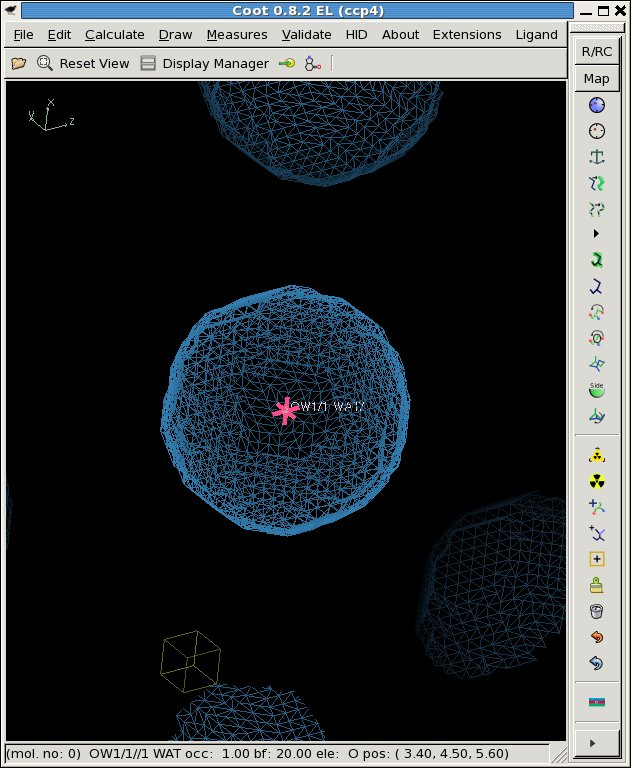

# floatgen: stream 4-byte floating-point numbers from text


This simple program reads text from standard input and outputs 4-byte "float" values,
or single-precision floating-point numbers. It is useful for generating binary data
from scratch, or from a program that only outputs text.

These flat floating-point files can then be input into image generation programs like
[noisify][noisify] or combined with simulation data from [nearBragg][nearbragg].
It can also generate data to directly replace the voxel values in an electron density map.

## source code

source: [floatgen.c](../floatgen.c)

There are no dependencies beyond the standard C math libraries shipped with essentailly
all modern C compilers.

## compile

```bash
gcc -o floatgen floatgen.c -lm
```

## example usage

Check that it works, using the unix octal-dump (`od`) program:

```bash
echo "123.456" | ./floatgen | od -f
0000000   1.234560e+02
0000004
```

The `od` program for dumping binary values in various formats has been around in linux and unix
for decades. It should already be installed on your computer.

Another mainstay linux program is `awk`, which is useful for writing little one-line text
re-formatting programs. We can use `awk` to make a 3D field of values.  In this case, a ball,
3A in radius centered at (x,y,z) = (3.4,4.5,5.6) in a unit cell with dimensions 10, 20, 30.

```bash
awk 'BEGIN{for(s=0;s<32;++s)\
           for(r=0;r<32;++r)\
           for(c=0;c<32;++c){\
             x=c*10.0/32;y=r*11.0/32;z=s*12.0/32;\
             d=sqrt((x-3.4)**2+(y-4.5)**2+(z-5.6)**2);\
             print (d<3)}}' |\
cat >! <a href=3Dball.txt>3Dball.txt</a>
```

You can copy-and-paste the above text to a terminal window and get the same result.
The text file 3Dball.txt is 32768 lines of "1" and "0", representing values on a 32x32x32 grid.
The value is "1" for voxels within 3 A of the point, but as you can see they are all just 
numbers in a row.

What can you do with this?  Well, one thing you can do is use `floatgen` to convert it into a
[CCP4 format electron density map][maplib].  Of course, we need a header, but we can get one by
generating an empty map and then hijacking that maps's contents. I wrote a little script for doing
this I call [make_maphead.com](../make_maphead.com).

```bash
./make_mapheaad.com -grid 32 32 32 -cell 10 11 12 90 90 90
mv header.map 3Dball.map
```

Now we are ready to append the floating-point data to the header and complete the map

```bash
cat 3Dball.txt | ./floatgen >> 3Dball.map
```

And then display it with your favorite map viewing program, such as [Coot][coot].
Here we generate a PDB file to mark the central x-y-z coordinate of the ball generated in 3Dball.txt

```bash
cat << EOF >! 3Dball.pdb
CRYST1   10.000   10.000   10.000  90.00  90.00  90.00 P 1                      
ATOM      1  OW1 WAT     1       3.400   4.500   5.600  1.00 20.00           O  
EOF
coot -p 3Dball.pdb --map 3Dball.map
```



You can probably think of more interesting shapes to put into the map.

## Author
<ADDRESS><A HREF="mailto:JMHolton@lbl.gov">James Holton &lt;JMHolton@lbl.gov&gt;</A></ADDRESS>


[adxv]: http://www.scripps.edu/~arvai/adxv.html
[rigaku]: https://www.rigaku.com
[mosflm]: http://www.mrc-lmb.cam.ac.uk/harry/mosflm/
[hkl]: http://www.hkl-xray.com
[xds]: http://xds.mpimf-heidelberg.mpg.de
[fmodel]: http://www.phenix-online.org/documentation/fmodel.htm
[refmac]: https://www2.mrc-lmb.cam.ac.uk/groups/murshudov/content/refmac/refmac.html
[sfall]: https://www.ccp4.ac.uk/html/sfall.html
[imagemagick]: http://www.imagemagick.org
[noisify]: https://github.com/bl831/bin_stuff/blob/main/docs/noisify.md
[float_add]: https://github.com/bl831/bin_stuff/blob/main/docs/float_add.md
[float_func]: https://github.com/bl831/bin_stuff/blob/main/docs/float_func.md
[float_mult]: https://github.com/bl831/bin_stuff/blob/main/docs/float_mult.md
[int2float]: int2flaot.md
[ccp4]: https://www.ccp4.ac.uk
[maplib]: https://www.ccp4.ac.uk/html/maplib.html
[coot]: https://www2.mrc-lmb.cam.ac.uk/personal/pemsley/coot/
[nanobragg]: https://github.com/bl831/nanoBragg
[nearbragg]: https://github.com/bl831/nearBragg
[nonbragg]: https://github.com/bl831/nanoBragg