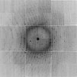

# int2float: convert X-ray images into floating point

This short program converts an "SMV" format X-ray image or other field of 16-bit
"unsigned short int" type data into a flat file of 4-byte "float" single-precision floating
point numbers. This format is identical to the "floatimage.bin" files
output by my [nearBragg][nearbragg], [nanoBragg][nanobragg], and [nonBragg][nonbragg]
simulators, making the output of `int2float` suitable for direct side-by-side comparison of 
simulated data to real data using [float_add][float_add].

The floating-point output of `int2float` may also be manipulated in other innovative ways, such as
subtracting idealized background extracted from the image using [nonBragg][nonbragg].
Or, arbitrary scaling, subtracting or mixing and matching using the core
floating-point flat-file manipulation programs [float_add][float_add], [float_mult][float_mult], or
[float_func][float_func].

Once the transformations are complete, the 4-byte float file can be converted back into an "SMV"
format image using [noisify][noisify].

## source code

source: [int2float.c](int2float.c)

There are no dependencies beyond the standard C math libraries shipped with essentailly
all modern C compilers.

## compile

```bash
gcc -O -O -o int2float int2float.c -lm
```

## example usage

Get an SMV x-ray image here:

```bash
wget http://bl831.als.lbl.gov/example_data_sets/ALS/831/Gd_lyso1/ALS831_lyso_Gd_001.img
```

 

Convert the SMV image to floats

```bash
./int2float -header 512 ALS831_lyso_Gd_001.img smv.bin
```

use the unix `od` utility to view the result:

```bash
od -f smv.bin | head
0000000   8.224000e+03   8.224000e+03   8.224000e+03   8.224000e+03
*
0000140   1.000000e+01   0.000000e+00   0.000000e+00   0.000000e+00
0000160   0.000000e+00   0.000000e+00   0.000000e+00   0.000000e+00
*
0060000   0.000000e+00   0.000000e+00   4.000000e+01   4.000000e+01
0060020   4.000000e+01   1.600000e+01   2.400000e+01   3.800000e+01
0060040   4.700000e+01   4.200000e+01   3.200000e+01   2.700000e+01
0060060   4.000000e+01   4.300000e+01   3.600000e+01   3.300000e+01
0060100   4.000000e+01   4.200000e+01   3.800000e+01   3.400000e+01
```

Compare this with the pixel values you get from the original file:

```bash
od -t u2 --skip=512 ALS831_lyso_Gd_001.img | head
0001000  8224  8224  8224  8224  8224  8224  8224  8224
*
0001060    10     0     0     0     0     0     0     0
0001100     0     0     0     0     0     0     0     0
*
0031000     0     0    40    40    40    16    24    38
0031020    47    42    32    27    40    43    36    33
0031040    40    42    38    34    48    43    50    37
0031060    27    43    39    43    43    35    35    38
0031100    46    40    31    37    36    29    26    52
```

Now you can do any number of things to the floating-point values using the 
[float_add][float_add], [float_mult][float_mult], or [float_func][float_func] utilities.
For example, you can convert the pixel values into photon counts like this:

```bash
float_add smv.bin smv.bin -scale1 0.625 -scale2 0 -offset 40 -outoffset 0 photons.bin
od -f photons.bin | head
0000000        4546.212        4546.212        4546.212        4546.212
*
0000140      -16.664999          -22.22          -22.22          -22.22
0000160          -22.22          -22.22          -22.22          -22.22
*
0060000          -22.22          -22.22               0               0
0060020               0      -13.331999          -8.888          -1.111
0060040       3.8884997           1.111          -4.444      -7.2214994
0060060               0       1.6664999          -2.222      -3.8884997
0060100               0           1.111          -1.111      -3.3329997
```

Notice that the photon "counts" are not integers.  This is normal.
We are correcting for a "detector gain" of 1.6 by multiplying the pixel values 
by 0.625, after subtracting the "ADC offset" of 40.

Depending on wavelength, angle, and other factors the signal recorded by
the detector from a single photon hit can vary, and in general the value
recorded in the image file is related to the photon count by a scale factor
called the "gain" and an offset called the "adc offset".  These
are the same gain and adc offset you need to provide to data processing 
programs if they are not set correctly by default.

In this case, we are using a gain of 1.6 ADU/photon and an offset of 40 ADU.
Where "ADU" is an "Area Detector Unit", or the signal required to increment
the integer value stored in the image file by one tick.

Although often incorrectly referred to as "counts" one ADU does not 
necessarily mean one X-ray photon. The "gain" in ADU/photon depends not only
on the sensitivity of the detector (which varies with wavelength, incidence
angle, and other factors), but also on the choice of binning mode, and the
setting of the amplifier before the analog-to-digital converter (ADC).
Because of this, the gain has little to do with the "quality" of the detector,
but it is still important to give the right value to your data processing
package.

The pixel values also contain an offset: 40 ADU in this case.  This is because
the CCD read-out circuit always introduces a certain amount of noise and this
noise is equally likely to be positive or negative, but the "unsigned integer"
data type used in the image file cannot represent a negative value, it would
"wrap around" and become an overload!  To keep this from happening, a small
constant value is added to ever pixel: the ADC offset.  It is large enough
to garantee the value cannot go negative, but small enough not to use up 
too much of the 16 bit dynamic range.  The CCD read-out noise level here is
about rms 3 pixel levels (aka ADU), so an offset of 40 is safe.

So, when you see a value of 40 "counts" in an ADSC image, it is really
representing zero photons.

So, we could round off the photons to integers, but that would introduce
roundoff error, adding noise to the data.  Yes, the original digitization
of the signal from the CCD also introduced roundoff error, but there is 
nothing we can do about that now. Fortunately, by selecting a "gain" greater
than one the roundoff error is kept much smaller than the photon-counting error.

Now let's convert the photon counts back into an SMV file using [noisify][noisify]:

```bash
./noisify -floatfile photons.bin -nonoise -gain 1.6 -adc 40.5 -header ALS831_lyso_Gd_001.img -intfile intimage.img
adxv intimage.img
```

 

The SMV-format image output in this way should be byte-for-byte identical to 
the original SMV-format image input into `int2float`.  The reason for using an
ADC offset of 40.5 instead of 40 is because `noisify` internally rounds all 
photon counts into integers.


## Command-line options

***-header 512***

> The number of bytes to skip as a header, default: 512.

## Author

<ADDRESS><A HREF="mailto:JMHolton@lbl.gov">James Holton &lt;JMHolton@lbl.gov&gt;</A></ADDRESS>


[adxv]: http://www.scripps.edu/~arvai/adxv.html
[rigaku]: https://www.rigaku.com
[mosflm]: http://www.mrc-lmb.cam.ac.uk/harry/mosflm/
[hkl]: http://www.hkl-xray.com
[xds]: http://xds.mpimf-heidelberg.mpg.de
[fmodel]: http://www.phenix-online.org/documentation/fmodel.htm
[refmac]: https://www2.mrc-lmb.cam.ac.uk/groups/murshudov/content/refmac/refmac.html
[sfall]: https://www.ccp4.ac.uk/html/sfall.html
[imagemagick]: http://www.imagemagick.org
[noisify]: https://github.com/bl831/bin_stuff/blob/main/docs/noisify.md
[float_add]: https://github.com/bl831/bin_stuff/blob/main/docs/float_add.md
[float_func]: https://github.com/bl831/bin_stuff/blob/main/docs/float_func.md
[float_mult]: https://github.com/bl831/bin_stuff/blob/main/docs/float_mult.md
[int2float]: int2flaot.md
[ccp4]: https://www.ccp4.ac.uk
[maplib]: https://www.ccp4.ac.uk/html/maplib.html
[coot]: https://www2.mrc-lmb.cam.ac.uk/personal/pemsley/coot/
[nanobragg]: https://github.com/bl831/nanoBragg
[nearbragg]: https://github.com/bl831/nearBragg
[nonbragg]: https://github.com/bl831/nanoBragg
