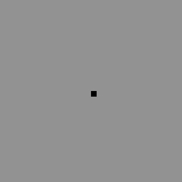
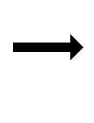
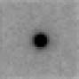
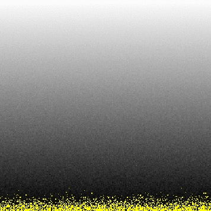

# noisify 

Utility to convert photons/pixel into X-ray image formats

  

This simple program converts a raw, flat file of 4-byte single-precision 
floating point numbers representing "phtons/pixel", such as the "floatimage.bin" files
output by my [nearBragg][neabragg], [nanoBragg][nanobragg], and [nonBragg][nonbragg]
simulators, into an "SMV" format X-ray image. The "Super Marty View" or SMV format is one of the
most widespread and long-lived format for X-ray images. It was used by Area Detector Systems
Corporation (ADSC) and more recently by [Rigaku][rigaku]. It is programmatically convenient because
it is a "flat" file format, with the bytes stored uncompressed. It can be converted to other
formats such as CBF by using [CBFlib][cbflib].

The noise model used by `noisify` is relatively simplistic, but still comprehensive.
In general, noise is either proprotional to the signal, such as flicker
noise, shutter jitter, or calibration errors, independent of the signal, such
as read-out noise, or proportinal to the square root of the signal, which
is photon-counting noise.  This program implements all three, with inputs
in real-world units.  See the command-line options below.

`noisify` will also implement a fiber-coupled-CCD-like point spread function using the formula
derived by [Holton et al. 2010](http://dx.doi.org/10.1107%2FS0909049512035571).

## source code

source: [noisify.c](../noisify.c)

## compile

there are no dependencies beyond the standard C math libraries shipped with essentailly
all modern C compilers.

```
gcc -O -O -o noisify noisify.c -lm
```

## example usage

Now we need some floating-point values.  Might as well use [floatgen](floatgen.md) to make a ramp:

Compile `floatgen`

```
gcc -o floatgen floatgen.c -lm
```

Create ramp:

```
seq 0 65535 | ./floatgen >! ramp.bin
```

Now we run these pixel values through `noisify`. It will use some sensible defaults for detector geometry
to put into the header (it does not affect the results), and guess at the x-y size of the detector:

```
./noisify -floatfile ramp.bin
```

output:

```bash
noisify - add noise to pixels - James Holton 10-4-15
WARNING: guessing xy pixel dimensions.
importing 65536 pixel intensites: ramp.bin
  distance=0.1 detsize=0.0256x0.0256  pixel=0.0001 meters (256x256 pixels)
  Xbeam=0.0128 Ybeam=0.0128
  seed: -1455650997
  calibration noise seed: 123456789
  calibration_noise = 0 %
  input file scale = 1
  readout_noise = 0 ADU
  flicker_noise = 0 %
  quantum_gain = 1 ADU/photon
  adc_offset = 40 ADU

maximum value in input file: 65535 ( 65535 on photon scale)
writing intimage.img as 65536 2-byte integers
writing image.pgm as 1-byte integers
2147701149 photons on noise image (786 overloads)
writing noiseimage.img as 2-byte integers
```

Visualize:

```bash
mv noiseimage.img ramp.img
adxv ramp.img
```



You can see that although the "true" pixel values are ramping up linearly in the input file
"ramp.bin", the "x" direction is moving fastest and the "y" direction is slower. There is also
"fuzziness" to the image because `noisify` added Poissonian photon-counting noise.

To see what diffraction data look like, download and compile nanoBragg:
<pre>
wget <a href=http://bl831.als.lbl.gov/~jamesh/nanoBragg/nanoBragg.c>http://bl831.als.lbl.gov/~jamesh/nanoBragg/nanoBragg.c</a>
gcc -O -O -o nanoBragg <a href=http://bl831.als.lbl.gov/~jamesh/nanoBragg/nanoBragg.c>nanoBragg.c</a> -lm
</pre>

make an image with it:
<pre>
awk 'BEGIN{for(h=-10;h<=10;++h)for(k=-10;k<=10;++k)for(l=-10;l<=10;++l) print h,k,l,-log(rand())}' >! random.hkl
./nanoBragg -hkl random.hkl -cell 20 20 20 90 90 90 -N 50 -misset 10 20 30
mv noiseimage.img nanoBragg.img
adxv <a href=nanoBragg.img>nanoBragg.img</a>
 
</pre>

In this case, the default image is too faint to see much (left). If you zoom 
in (right) some of the spots are apparent, but weaker features are 
below the noise.
Since <a href=http://bl831.als.lbl.gov/~jamesh/nanoBragg/>nanoBragg</a>
 runs can be slow, it may not be desirable to run it all again just to change
 the overall scale.  This is why nanoBragg writes out a "floatimage.bin"
 flat file of 4-byte floats.  That way, you can repeat the final scaling
 and noise calculation step with this command:

<pre>
./noisify -floatfile floatimage.bin -header nanoBragg.img -scale 1000 -readnoise 3
mv noiseimage.img upscaled.img
adxv <a href=upscaled.img>upscaled.img</a>
 
</pre>

Now you can see the weak inter-Bragg features (left) that were rendered by 
nanoBragg, but too hard to see in the original output.  
Some of the spots are very bright (right), but the tails of the normal point-
spread function of a fiber-coupled CCD detector are not apparent.  These
can be turned on in noisify, however, with a simple switch:


<pre>
./noisify -floatfile floatimage.bin -header nanoBragg.img -scale 1000 -psf fiber -readnoise 3
mv noiseimage.img psfed.img
adxv <a href=psfed.img>psfed.img</a>
 
</pre>

Now the zoomed- out image has the familiar tails around the really bright 
spots you expect to find on a CCD.  The PSF can also be made Gaussian.

<hr>
Command-line options:<br>
<dl>
<dt> -floatfile floatimage.bin <dt>
<dd>  raw, flat, 4-byte float pixel values <dd>
<dt> -scale <dt>
<dd>  scale factor to put floatimage.bin in photons/pixel <dd>
<dt> -gain <dt>
<dd>  pixel units per photon <dd>
<dt> -readout_noise <dt>
<dd>  gaussian noise added to every pixel <dd>
<dt> -flicker <dt>
<dd>  fractional 1/f noise in source <dd>
<dt> -calibration <dt>
<dd>  static fractional error per pixel <dd>
<dt> -calib_seed <dt>
<dd>  change seed for calibration error <dd>
<dt> -seed <dt>
<dd>  specify seed for all non-calibration errors <dd>
<dt> -gain <dt>
<dd>  pixel units per photon <dd>
<dt> -adc <dt>
<dd>  offset added to each pixel after noise <dd>
<dt> -distance <dt>
<dd>  distance from origin to detector center in mm <dd>
<dt> -detsize <dt>
<dd>  detector size in mm <dd>
<dt> -pixel <dt>
<dd>  detector pixel size in mm <dd>
<dt> -psf <dt>
<dd>  gauss|fiber point spread function type (gaussian or fiber) <dd>
<dt> -psf_fwhm <dt>
<dd>  point spread function size in um <dd>
<dt> -psf_radius <dt>
<dd>  radius to render PSF in pixels (default automatic) <dd>
<dt> -lambda <dt>
<dd>  incident x-ray wavelength in Angstrom <dd>
<dt> -intfile <dt>
<dd>  name of smv-formatted output file (arbitrary scale) <dd>
<dt> -pgmfile <dt>
<dd>  name of pgm-formatted output file (arbitrary scale) <dd>
<dt> -noisefile <dt>
<dd>  name of smv-formatted output file (with noise) <dd>
<dt> -Xbeam <dt>
<dd>  image X coordinate of direct-beam spot (mm) <dd>
<dt> -Ybeam <dt>
<dd>  image Y coordinate of direct-beam spot (mm) <dd>
<dt> -header <dt>
<dd>  import 512-byte header from specified SMV file <dd>
</dl>
<hr>
Author:
<ADDRESS><A HREF="mailto:JMHolton@lbl.gov">James Holton &lt;JMHolton@lbl.gov&gt;</A></ADDRESS>
<br>

[nearbragg]: https://github.com/bl831/nearBragg
[nanobragg]: https://github.com/bl831/nanoBragg
[nonbragg]: https://github.com/bl831/nonBragg
[rigaku]: https://www.rigaku.com
[cbflib]: http://www.bernstein-plus-sons.com/software/CBF
