# X-ray images formats

Possibly the most widespread and long-lived format for X-ray images is the 
"Super Marty View" or SMV format used by Area Detector Systems Corporation (ADSC)
and more recently by [Rigaku][rigaku]. It is programmatically convenient because it is a "flat"
file format, with the bytes stored uncompressed.

You can get an SMV x-ray image here:

```bash
wget http://bl831.als.lbl.gov/example_data_sets/ALS/831/Gd_lyso1/ALS831_lyso_Gd_001.img
```

 

The SMV format always has a text header, and it is almost always 512 bytes.
The top of the header will tell you how many bytes, so you can check with the
unix "head" command:

```bash
head -n 2 ALS831_lyso_Gd_001.img
```

output:

```bash
{
HEADER_BYTES=  512;
```

So now you know its definitely 512 bytes, and you can read the whole thing like this:

```bash
head --bytes=512 ALS831_lyso_Gd_001.img
```

output:

```bash
{
HEADER_BYTES=  512;
DIM=2;
BYTE_ORDER=little_endian;
TYPE=unsigned_short;
SIZE1=3072;
SIZE2=3072;
PIXEL_SIZE=0.102592;
BIN=2x2;
BIN_TYPE=HW;
ADC=fast;
CREV=1;
BEAMLINE=ALS831;
DETECTOR_SN=926;
DATE=Tue Jun 26 09:43:09 2007;
TIME=0.096288;
DISTANCE=249.98;
TWOTHETA=0.00;
PHI=342.000;
OSC_START=342.000;
OSC_RANGE=1.000;
WAVELENGTH=0.979340;
BEAM_CENTER_X=154.96;
BEAM_CENTER_Y=155.91;
DENZO_X_BEAM=159.25;
DENZO_Y_BEAM=154.96;
}
```

Some of these are more important to the end user than others, but most
modern beamlines put the correct values into the headers. However, as
exemplified by the direct-beam center, the "correct" value depends on which
software package you plan to use to process the images. 
[Denzo/HKL][hkl], [MOSFLM][mosflm], [XDS][xds], and the native viewer [ADXV][adxv]
all use different conventions for repesenting the beam center,
so make sure you use the right one for your program.

To look at the pixel values yourself, use the unix `od` utility:

```bash
od -t u2 --skip=512 ALS831_lyso_Gd_001.img | head
0001000  8224  8224  8224  8224  8224  8224  8224  8224
*
0001060    10     0     0     0     0     0     0     0
0001100     0     0     0     0     0     0     0     0
*
0031000     0     0    40    40    40    16    24    38
0031020    47    42    32    27    40    43    36    33
0031040    40    42    38    34    48    43    50    37
0031060    27    43    39    43    43    35    35    38
0031100    46    40    31    37    36    29    26    52
```

you can also inspect this image in [ADXV][adxv] or any other X-ray image viewer
and see that the first few pixels in the upper left corner really do have value
8224 (which is not typical, but convenient here), followed by a few rows of zeroes, and 
then followed by the actual active detector pixel values.

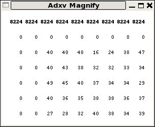

For ADSC detector images an offset value of "40" is used to denote zero photons.
This is because the signal is stored as unsigned integers, and negative values 
would wrap-around to an overload. The CCD read-out noise level here is about rms 3 pixel levels
(aka ADU), so an offset of 40 is safe. 

Although often incorrectly referred to as "counts" a change of "1" 
in the integer used in this file to represent a pixel value does not 
neccesarily mean one X-ray photon. For this reason the pixel 
level value is more accurately referred to as an "area detector unit" (ADU)
and the "gain" of the detector tells you the ratio of ADU per photon.
The gain depends not only on the senitivity of the detector (which
varies with wavelength, incidence angle, and other factors), but also
on the desired binning, and the setting of the amplifier before the 
analog-to-digital converter (ADC).

Because of this, the gain has little to do with the "quality" of the detector,
but it is still important to give the right value to your data processing
package.  In the case of this image the gain is 1.8 ADU/photon.


You can also look at SMV images with the popular image display and manipulation package
[ImageMagick][imagemagick]:

```
display -depth 16 -colorspace GRAY -endian LSB -size 3072x3072+512 GRAY:ALS831_lyso_Gd_001.img
```

Although you may need to "normalize" in the GUI before you can see anything. This is because most of
the pixel values are smaller in the full 16-bit range of the pixels, so they look black. And yes,
you can also use [ImageMagick][imagemagick] to convert X-ray images to "regular" image file formats:

```bash
convert -depth 16 -colorspace GRAY -endian LSB -size 3072x3072+512 GRAY:ALS831_lyso_Gd_001.img -normalize -resize 1024x1024 -negate smaller.jpg
```

and display results:

```bash
display smaller.jpg
```

and then convert it back, after recovering the header from the original image:

```bash
head --bytes=512 ALS831_lyso_Gd_001.img >! jpeged.img
convert smaller.jpg -negate -resize 3072x3072 -depth 16 -colorspace GRAY -endian LSB GRAY:- >> jpeged.img
adxv jpeged.img
```

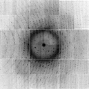 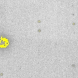

If these unix commands don't work, then you are probably using bash.
You will find a file named "!" in this case. Type the
command "tcsh" to switch to a shell that supports this example formatting.
(if you insist on using bash, then you should know bash syntax).

Once you are using tcsh and examining jpeged.img in adxv
you will notice the X-ray data in the image didn't really survive:

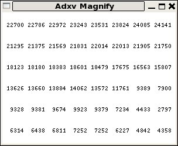

The pixel values are all huge, the spots are overloaded, and the image is blury.
This is becuase we converted it to jpeg, which looses information, and we also normalized it.
If we don't do these things, we can preserve the X-ray data:

```bash
convert -depth 16 -colorspace GRAY -endian LSB -size 3072x3072+512 GRAY:ALS831_lyso_Gd_001.img -compress lzw adsc.tif
head --bytes=512 ALS831_lyso_Gd_001.img >! tiffed.img
convert adsc.tif -depth 16 -colorspace GRAY -endian LSB GRAY:- >> tiffed.img
adxv tiffed.img
```

 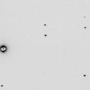

If everything worked, then the file `tiffed.img` should be precisely identical to the original file
`ALS831_lyso_Gd_001.img`. You can confirm this with the unix program `cmp`:

```
cmp ALS831_lyso_Gd_001.img tiffed.img
```

which will output nothing if the files are indeed identical.

Now, you can use any of the features of [ImageMagick][imagemagick] to edit the image, such as
blanking off the beamstop:

```bash
head --bytes=512 ALS831_lyso_Gd_001.img >! noBS.img
convert adsc.tif -depth 16 -colorspace GRAY -endian LSB -draw "circle 1513,1554 1513,1664" GRAY:- >> noBS.img
adxv noBS.img
```

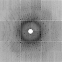 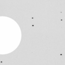

note that [ADXV][adxv] and [ImageMagick][imagemagick] use the same x-y coordinate conventions.

Another trick is to subtract the background using a median filter:

```bash
convert adsc.tif -median 15 smooth.tif
convert -fx 'u-v+0.00061' adsc.tif smooth.tif diff.tif
head --bytes=512 ALS831_lyso_Gd_001.img >! spots.img
convert diff.tif -depth 16 -colorspace GRAY -endian LSB GRAY:- >> spots.img
adxv spots.img
```

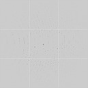 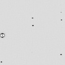

Which could be useful for autoindexing or raster-based location of crystals.


## CIF format images

If you have a Pilatus detector, you are not out of luck. Pilatus images can be converted to SMV using 
[ADXV][adxv]:

```bash
wget http://bl831.als.lbl.gov/example_data_sets/SLS/X06SA/lyso/lysozym-1_1_00001.cbf
adxv -sa lysozym-1_1_00001.cbf pilatus.img
adxv pilatus.img &
```

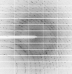 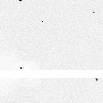

```bash
convert -depth 16 -colorspace GRAY -endian LSB -size 2463x2527+512 GRAY:pilatus.img pilatus.tif
head --bytes=512 pilatus.img >! pilatus_noBS.img
convert pilatus.tif -depth 16 -colorspace GRAY -endian LSB -draw "rectangle 0,1203 1270,1321" GRAY:- >> pilatus_noBS.img
adxv pilatus_noBS.img
```

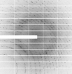 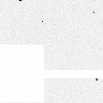

Notice that the last command blacked-out the beamstop shadow. Yes, you can process SMV images from
a Pilatus and it will not hurt your data. You just need to make sure the processing program has the
right idea about invalid pixels.

One problem, however, is that the SMV format typically only supports 16 bits and the Pilatus images
have 20 bits. But SMV does support other data types, such as 32 bit integers.
You convert those like this:

```bash
adxv -smv32bits -sa lysozym-1_1_00001.cbf pilatus32.img
adxv pilatus32.img &
```

How can you tell if an SMV file is 16 or 32 bits?  Look at the header.
It is text, and not hard to understand:

```bash
head --bytes=512 pilatus32.img
{
HEADER_BYTES=  512;
COMMENT=Written by adxv;
DIM=2;
SIZE1=2463;
SIZE2=2527;
TYPE=unsigned_short;
BYTE_ORDER=little_endian;
DISTANCE=380.000;
PIXEL_SIZE=0.172000;
WAVELENGTH=0.999900;
BEAM_CENTER_X=211.30;
BEAM_CENTER_Y=219.39;
TYPE=long_integer;
}
```

Note that the data type is mentioned twice, but the last one is correct: long_integer, or 32 bits.

So, why not black out the beamstop in 32 bit mode all the time?  Well, [ImageMagick][imagemagick]
doesn't really fully support 32 bits. And then there is some confusion about signed or unsigned
pixels. If you try this:

```bash
convert -depth 32 -colorspace GRAY -endian LSB -size 2463x2527+512 GRAY:pilatus32.img pilatus32.tif
head --bytes=512 pilatus32.img >! pilatus32_noBS.img
convert pilatus32.tif -depth 32 -colorspace GRAY -endian LSB -draw "rectangle 0,1203 1270,1321" GRAY:- >> pilatus32_noBS.img
adxv pilatus32_noBS.img &
```

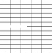

You will see that the beamstop is zeroed out, but all the data has been changed to zero as well.
Different versions of ImageMagick will do different things here.

You can probably see that one can do a lot with [ADXV][adxv] and [ImageMagick][imagemagick], but
sometimes the manipulations you want to make on the data are hard to "explain" to
[ImageMagick][imagemagick], and definitely prone to round-off error if you are working with only
integers and multiplying and dividing by things. This is why you might want to work in
floating-point, and convert to integers only at the last step.  This is why my 
[nearBragg][nearbragg], [nonBragg][nonbragg], and [nanoBragg][nanobragg] 
simulators always output a "floatimage.bin" file.  So you don't have to re-run the simulation if all you
want to do is something simple, like change the overall scale. But, when you convert back to X-ray image
format it is convenient if that converter understands how to handle overloads and zeroes and the like.

For simulations, it is also convenient to be able to re-do the noise, perhaps with a different random
number seed. This is why I wrote [noisify][noisify]. But first, you might want to convert the X-ray
diffraciton image in front of you into floating-point values, so that you can work without worrying
about roundoff, and this is done with [int2float][int2float].

## going 3D: electron density

A common natively-floating-point X-ray format is the electron density map.  These have come in
more than a few flavors over the years, but a very common one today is the binary map format
from the [CCP4 suite][ccp4].  Their documentation of the fortran and C libraries for working with
these maps is [here][maplib].

But, of you are lazy (like me), you can "hack" the map format by creating your own field of 
floating-point values on the same grid as a given map and then cut-and-paste the header of a properly
generated map in front of the data and voila!, you can look at your 3D data in [Coot][coot].

A nice jiffy program for applying various mathematical functions to maps is here:
[map_func.com](map_func.com)

## Author:
<ADDRESS><A HREF="mailto:JMHolton@lbl.gov">James Holton &lt;JMHolton@lbl.gov&gt;</A></ADDRESS>
<br>


[adxv]: http://www.scripps.edu/~arvai/adxv.html
[rigaku]: https://www.rigaku.com
[mosflm]: http://www.mrc-lmb.cam.ac.uk/harry/mosflm/
[hkl]: http://www.hkl-xray.com
[xds]: http://xds.mpimf-heidelberg.mpg.de
[fmodel]: http://www.phenix-online.org/documentation/fmodel.htm
[refmac]: https://www2.mrc-lmb.cam.ac.uk/groups/murshudov/content/refmac/refmac.html
[sfall]: https://www.ccp4.ac.uk/html/sfall.html
[imagemagick]: http://www.imagemagick.org
[noisify]: https://github.com/bl831/bin_stuff/blob/main/docs/noisify.md
[float_add]: https://github.com/bl831/bin_stuff/blob/main/docs/float_add.md
[float_func]: https://github.com/bl831/bin_stuff/blob/main/docs/float_func.md
[int2float]: int2flaot.md
[ccp4]: https://www.ccp4.ac.uk
[maplib]: https://www.ccp4.ac.uk/html/maplib.html
[coot]: https://www2.mrc-lmb.cam.ac.uk/personal/pemsley/coot/
[nanobragg]: https://github.com/bl831/nanoBragg
[nearbragg]: https://github.com/bl831/nearBragg
[nonbragg]: https://github.com/bl831/nanoBragg